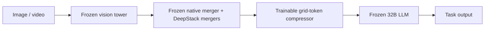

# Pre-Prefill Visual Token Compressor with RetentionKD

> Clean-room reference implementation and evidence packet for research review.

## 中文摘要

这个仓库整理了一条面向垂类多模态模型的视觉 token 压缩路线：在 Qwen3-VL 原生
visual merger 之后、冻结的 32B LLM prefill 之前插入一个可训练 compressor。Vision
Tower、原生 merger、DeepStack 分支和 LLM 均保持冻结，只有 compressor 更新。因此这里的
“SFT”准确说是 **compressor-only post-training**，不是完整 Vision Encoder SFT。

训练和验证可以使用内部数据；本仓库只公开 clean-room 方法实现、匿名数据合同、获批聚合指标
和统计边界，不公开内部数据集、样本、业务标签定义、Prompt、模型资产或平台代码。

## Research question

Can a small post-merger compressor preserve task behavior while reducing the visual-token sequence seen by a frozen domain-specialized multimodal LLM?



The structural reference configuration groups each `2 x 2` neighborhood of native-merger tokens into one compressed token, independently for every image/frame region. Main-stream and DeepStack features use the same grouping plan. In the evaluated private-domain workload this retained about `26.4%` of visual tokens (about `73.6%` reduction); deployment speed and capacity gains have not yet been measured under a fixed serving contract.

## Training path

1. **Feature-only warm-up.** Learn the compressor from uncompressed main and multi-scale DeepStack features while the backbone remains frozen.
2. **Naive task SFT.** Task-only adaptation sharply damaged recall, F1, and output validity, motivating retention constraints.
3. **RetentionKD repair.** Combine hard-label task supervision with feature protection, response-distribution JSD, visual-semantic distillation (VSD), vision-language affinity distillation (VLAD), and CE-anchored gradient budgeting.

The matched ablation is:

```text
Control = hard-label CE + feature protection
Full    = Control + response JSD + VSD + VLAD
```

See [the complete method](docs/METHOD.md), [training-framework notes](docs/ENGINEERING_NOTES.md), [evaluation protocol](docs/EXPERIMENT_PROTOCOL.md), and [current evidence](docs/EXPERIMENT_STATUS.md).

## What the current evidence supports

- On two private Dev256 studies, the selected Full checkpoint improved task metrics over a strictly matched Control at the same token budget.
- On the independent confirmation Dev256, Full vs Control changed precision/recall/F1/accuracy from `45.71/66.67/54.24/86.33%` to `58.06/75.00/65.45/89.84%`.
- The paired uncertainty is still open: exact McNemar `p=0.1755`, and the paired-bootstrap F1 interval crosses zero.
- On the first same-member Dev256, a retrospective matched identity reference gives Full-u64 F1 `69.57%` versus identity `66.67%` (`+2.90pp`) and precision `69.57%` versus `60.71%`, with equal accuracy. Full-u64 nevertheless had lower recall (`69.57%` versus `73.91%`), one more false negative, and lower output validity. This is a descriptive F1/precision advantage with a quality trade-off, not comprehensive superiority.
- The second completed Full Dev256 and the historical identity Dev2,141 use different sample sets. Their headline F1 values (`65.45%` and `61.22%`) must **not** be compared as evidence that Full beats identity. A same-order Full Dev2,141 confirmation is still running.

## Repository map

- `src/pre_prefill_compressor/`: clean-room compressor, Qwen3-VL-style placeholder/grid adapter, retention losses, explicit per-objective DP gradient construction, evaluation, and checkpoint utilities.
- `examples/train_synthetic.py`: CPU synthetic demonstration; it does not reproduce the private experiment.
- `tests/`: contract and numerical tests using generated tensors only.
- `docs/EXPERIMENT_STATUS.md`: exact approved aggregate results, denominators, and non-claims.
- `docs/INTEGRATION_CONTRACT_AND_PSEUDOCODE.md`: sanitized Qwen forward,
  DeepStack, M-RoPE, shape, and image-only contracts.
- `docs/DATA_MODEL_SELECTION_CARD.md`: anonymous split/training/search accounting
  and explicit audit gaps.
- `docs/OPEN_EVIDENCE_AND_EXPERIMENT_BACKLOG.md`: requested-material matrix,
  gradient telemetry, live pending states, and prioritized experiments.
- `docs/NOVELTY_AND_NONCLAIMS.md`: closest-work analysis and provisional novelty boundary.
- `docs/WEB_PRO_REVIEW_PACKET.md`: self-contained prompt for a web-enabled research reviewer.

## Quick start

```bash
python -m venv .venv
source .venv/bin/activate
pip install -e '.[test]'
pytest
python examples/train_synthetic.py
```

## Disclosure boundary

This repository is a newly written reference implementation, not a mirror of an internal production repository. Authorized private data may be supplied through a user-owned data/model integration layer, but no private rows are required or distributed here. Internal paths, infrastructure identifiers, task payloads, prompts, logs, checkpoints, and credentials are intentionally excluded.

## Status

The package is intended to make the method auditable and to support a novelty/feasibility review. It is not a production deployment, a public-benchmark reproduction, or evidence of statistically significant superiority over an uncompressed model.
